# 什么是"榫"

嘶衣唔嗯ěn损，fao喽密，榫！

首先，让我们面向百度学习一波。

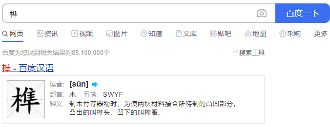

榫[sǔn]：制木竹等器物时，为使两块材料接合所特制的凸凹部分。


感觉不够直观，找点图看看。


再来点

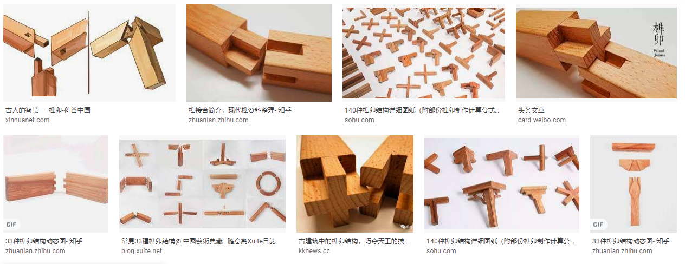

这里我借花献佛一下，榫说的是两块材料接合凸起的部分，凹进去的部分叫卯。

这东西是干什么用的呢，我不说大家也知道，是两块材料接合所用（切，这不废话吗，就是百度百科上说的么）。在中国建筑当中这个榫卯的用途可以说是处处皆是。现在已经火到了国外。

# 榫卯

本来两种材料，一榫、一卯搭配的天衣无缝，怪就怪这建筑用的多了起来之后，各种各样的榫，各种各样的卯。也没办法统一，垄断法了解一下。


>以下图片资源来自《设计模式之禅（第2版）》对其进行了一些简单的调整。

**原来都是这样进行搭配**


**突然有一天给了我一个**

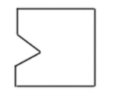

这两个材料怎么接，榫不对卯，卯不对榫，接不上啊。

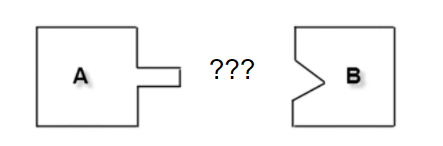

这可难不倒伟大的工匠艺人们，他们做出来了一个 榫卯，大概是这个样子。

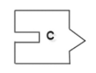

这样他们就能完美的接在一起使用了。这就是榫卯。

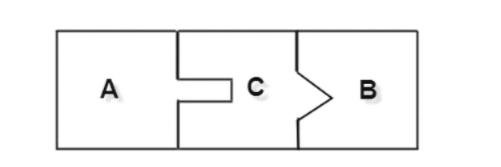

榫卯使得本来不能直接接合的材料能够接合起来了。看到这里让我想到了插在大哥电脑上的扩展坞

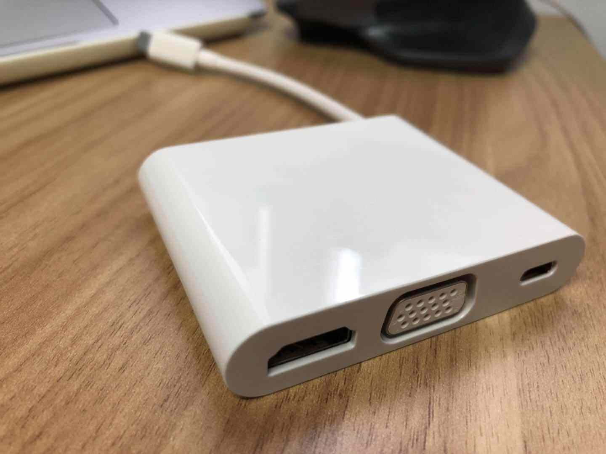

这是华为的扩展坞，整个电脑上就两个外接口，一个充电口，一个这个扩展坞的口。想接 USB 设备必须要经过这个扩展坞才可以。

# 适配器模式

> 将一个类的接口转换成客户希望的另外一个接口，使得原本由于接口不兼容而不能一起工作的那些类能一起工作。

首先大家要知道一个可能一直被大家忽略的一个问题就是，适配器模式一共有两种，一种是类适配器，另一种叫做对象适配器。这两个是什么东西呢，经过鄙人的一词一句话概括如下：

**类适配器：通过类的继承或者接口的实现来达到适配目的；**

**对象适配器：通过对象的组合来达到适配目的；**


## 适配器模式类图 📌

再来看看图，消化吸收一下。

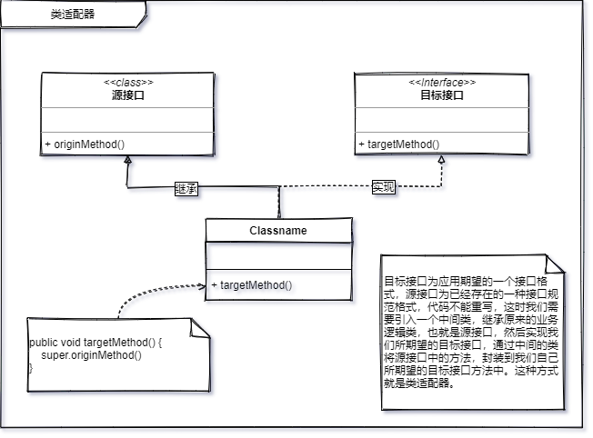

目标接口为应用期望的一个接口格式，源接口为已经存在的一种接口规范格式。

代码不能重写。（工作量，系统稳定性，等等原因。）

这时我们需要引入一个中间类，继承原来的业务逻辑类，也就是源接口，然后实现我们所期望的目标接口，通过中间的类将源接口中的方法，封装到我们自己所期望的目标接口方法中。这种方式就是**类适配器**。


**对象适配模式**是通过对象的组合来替代类的继承，好处我真的不想再说了，合成复用原则中讲过优先使用对象组合，其次考虑类的继承。

就像上一篇的桥接模式一样，继承虽方便，但扩展性太差。同时耦合度很多，如果真的是使用继承，一定是具备一定强度的耦合条件时才会考虑。

像对象四佩奇这种方式会更加的灵活。一般适配器更多会选为这种方式来进行两个接口的连接。


## 代码 📃

学习适配器模式的时候，我没有再去找一些应用的案例来学习，因为我就一直在用这个模式。

```java
public class DateUtil {

    public final static String YYYY_MM_DD = "yyyy-MM-dd";
    public final static String YYYY_MM_DD_TIGHT = "yyyyMMdd";

    public static String getTightDate(Date date) {
        Calendar calendar = new GregorianCalendar();
        calendar.setTime(date);
        SimpleDateFormat df = new SimpleDateFormat(YYYY_MM_DD_TIGHT, Locale.CHINA);
        return df.format(calendar.getTime());
    }

    public static String format(Date date) {
        if (date == null) {
            return null;
        } else {
            return new SimpleDateFormat(YYYY_MM_DD, Locale.CHINA).format(date);
        }
    }

}
```

这个是日期工具类，我们经常会有这种场景，数据库存放的是 Date 类型，但接口给过来的是 String 类型，或者这两者相反，总之需要将其正常存储或返回，这个时候我们通常会采取使用一个日期工具类，将数据格式进行一个转换，这其中，工具类担任的角色，我认为就是适配器的一个职责，”将两个本不能直接结合的材料进行了接合“。这个看起来很简单，但这就是适配的模式的精髓，就是为了解决类似问题而存在的。如果把上面的程序用一个类图来表示的话，就是这个样子。

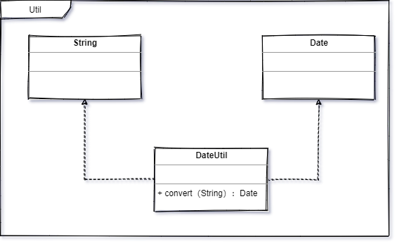


```java
/**
 * 数组工具类
 *
 * 欢迎跟我一起学习，公众号搜索：星尘的一个朋友
 * 也可以加我微信（lvgocc）拉你进群
 *
 * @author lvgorice@gmail.com
 * @version 1.0
 * @blog @see http://lvgo.org
 * @CSDN @see https://blog.csdn.net/sinat_34344123
 * @date 2020/10/29
 */
public class ArraysUtil {

    public static <T> List<T> asList(T... a) {
        return new ArrayList<>(a);
    }
    private static class ArrayList<E> extends AbstractList<E>
            implements RandomAccess, java.io.Serializable
    {
        private static final long serialVersionUID = -2764017481108945198L;
        private final E[] a;

        ArrayList(E[] array) {
            a = Objects.requireNonNull(array);
        }
        .......
            ......
    }
}
```

一个数组工具类，大家应该都很熟悉，没错，这就是 JDK 中的 Arrays 工具类中的 asList 方法。记住哦，这种方式创建出来的 List 是不能够使用 add 方法的哦，因为此 ArrayList（java.util.Arrays.ArrayList） 非彼 ArrayList (java.util.ArrayList)，这个 ArrayList 里面没有重写 add 方法，这个知识点是送的，别客气。


在列举一下 JDK 中的适配器大家看一看，随便感受一下就好了。


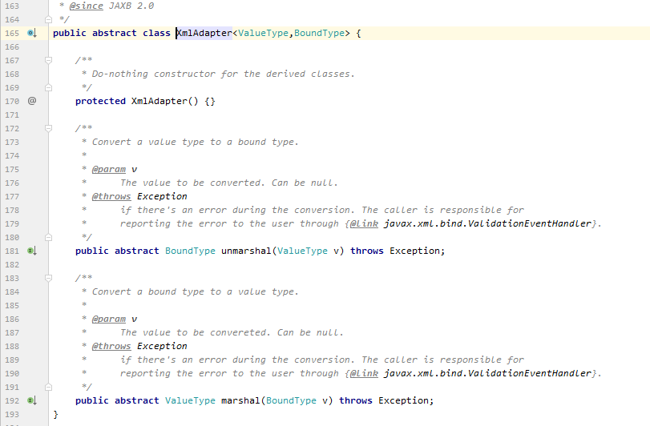


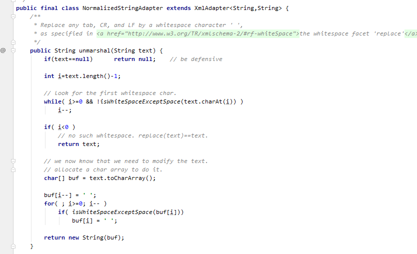


哦，这里还有群里小伙伴@ruize 提供的一个他写的适配器，一起和大佬学习一下

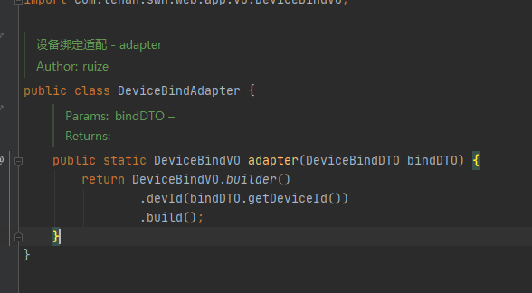


## 总结 📚

适配器模式叫我总结，只有两字。”能用就行“，为什么用这两个字来总结，是因为适配器本身就是一个再出现问题以后用来补救的。补丁一样。一般人不会上来就在系统初期写一些适配器在那里，如果是像上面列的一些对象转换型的适配那有点尴尬，合情合理。

适配器模式的出现是为了解决系统一些牵一发而动全身的事情，我们可以想象一下我的电脑没有 USB 接口（华为今年的最新款）难道我要把电脑拆了装个 USB 模组在里面吗？这显然是不可能的。所以有了扩展坞这东西。他就是为了解决这个问题的。（华为电脑这个是设计就没把外接设备接口留着，只留了一个充电的，和一个扩展坞的两个口）

1. 首先，适配器模式不会用在系统初期。
2. 其次，他是一个亡羊补牢一样的存在，你永远不知道系统的发展会遇到什么变故。只有出现需要的时候才会使用，不是故意设计的。就像你本来好好的接的 A 厂商接口，系统都开发完上线一年了，A 厂商说啥都不干了，你怎么办，现在有 B 厂商一样功能的接口，但接口规范不一样。这个时候就需要用适配器去补救了。
3. 代码复用，适配器模式可以充分的体现出代码复用。用一个适配类，解决修改老代码的尴尬局面。体现粗了老的代码可以完美的继续使（复）用。否则需要将老代码重构成新接口的规范，如果 B 厂商在换一次，估计开发人员头要炸了。


----
<div align="center">
    <b>亦或繁星、亦或尘埃。星尘✨，为了梦想，学习技术，不要抱怨、坚持下去💪。</b>
    <p>关注<b style='color:blue'>星尘的一个朋友</b>获取源码、加群一起交流学习🤓。</p>
    
</div>
