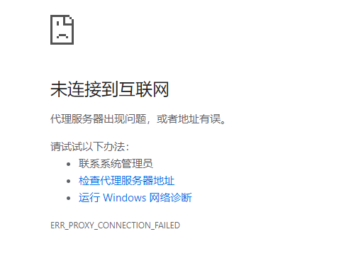
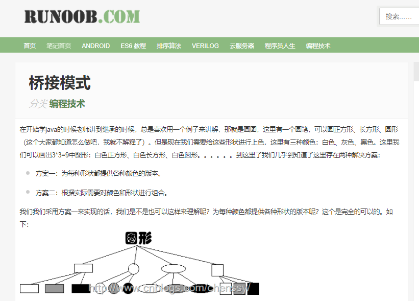

# 科普闲聊

>复杂度守恒定律由Larry Tesler于1984年提出，也称泰斯勒定律（Tesler's Law）。复杂度守恒定律（Law of conservation of complexity）由Larry Tesler于1984年提出，也称泰斯勒定律（Tesler's Law）。
根据复杂度守恒定律，每个应用程序都具有其内在的、无法简化的复杂度。无论在产品开发环节还是在用户与产品的交互环节，这一固有的复杂度都无法依照我们的意愿去除，只能设法调整、平衡。

这一观点主要被应用在交互设计领域。我们不得不面对的问题是，该由谁来为这一固有的复杂度埋单。打个比方，应该由软件开发工程师花费额外的时间来使软件变得更加简单好用，还是应该让用户自己去解决软件使用中可能存在的问题？

以上出自百度百科：[复杂度守恒定律 - 百度百科](https://baike.baidu.com/item/%E5%A4%8D%E6%9D%82%E5%BA%A6%E5%AE%88%E6%81%92%E5%AE%9A%E5%BE%8B/7508660?fr=aladdin)

---

如上所述，复杂度守恒定律是一个规避不掉的东西，最早的时候我接触到这个词是发出的一个提问，当时有各种大佬出来解答，大家感兴趣可以去看看。

 [到底什么是RPC?远程调用有什么好处?](https://bbs.csdn.net/topics/392308895)

```text
迷惑不解,不知是何.
我了解了一下dubbo框架,很多的术语搞得是更加模糊不清.
顺便提一点,
为什么深奥的东西就是被人向往的?
将复杂的东西弄成粗浅易懂的这不是更好吗?

2018-01-15 09:04:03
```

但我一直以为，技术的东西，本就不复杂。让它变得复杂的是我那迫切想要得到结果的心。

学习从来都没有捷径，你只是想要速成。学的快慢是一个问题，学与不学是另一个问题，听懂掌声。


---

# 学习时间

## 2020年10月的某一天午饭后

“桥接模式？，那是个啥” 心中突然蹦出这么一个想法。我心血来潮，打开 Google ，输入 ``桥接模式`` ，回车走你，等了半天。



这丝毫没有影响到我的情绪~~（艹）~~，随即我快速的切换搜索引擎视图忘掉刚刚发生的这一切。又是一记回车敲出，这次，它出现了


不知道是我手不行了，还是键盘要坏了，总之模式两字没带上，出来个桥梁，想着都差不多（呸，差不多个鬼）就看看吧，顺便学习了一下桥梁的专业释义（我就是这样东西越看越多，越看越杂的！龇牙咧嘴中！），我读了一下理解之后，这不就是**连接本来没关系的建筑**让他们之间可以相通，然后发生关系吗。可以，学到了（我靠，你原来不会是个傻子吧，桥梁是啥不知道吗，“知道知道，只是不专业，所以现在学东西都爱看底层，纠其根本。”）。

不行，得回过神来，继续找``桥梁模式``去。这怎么都一样啊，**抽象化**、**实现化**、**脱耦**看不懂啊，然后就是那个到处都是，其实出自菜鸟教程的图形案例。



> 图片来源：https://www.runoob.com/w3cnote/bridge-pattern2.html

先看看问题把，一个图形有2种形状（圆形、矩形）和2种颜色（红色、蓝色）的时候怎么去用类表示，我啥也不说，那肯定继承啊，我这 **封装、继承、多态老扎实了**。

心里念着”首先有一个**图形**的基类，然后开始继承走起 **红色的圆形**、 **红色的矩形**、 **蓝色的圆形**、**蓝色的矩形**。“ 没毛病，一个抽象类，四个实现类，搞定。代码写完，测一手。

```java
    @Test
    void shape(){
        Shape blueCircle = new BlueCircle();
        Shape blueRectangle = new BlueRectangle();
        Shape redCircle = new RedCircle();
        Shape redRectangle = new RedRectangle();

        blueCircle.create();
        blueRectangle.create();
        redCircle.create();
        redRectangle.create();
    }
```

```reStructuredText
蓝色の圆形
蓝色の长方形
红色の圆形
红色の长方形
```

感觉还可以，这时坐在我边上的大哥说了句，如果再加一种形状呢？

我：“卧槽，你啥时候来的，想要偷窥我学习？”

大哥：“先回答问题，别转移话题” 

我：“再加两个类不就行了”， **RedTriangle**、**BlueTriangle**，

大哥：“也还行，如果再这基础上再加一种绿颜色呢？” 

我：“额。。。再加三个类 **GreenCircle**、 **GreenRectangle**、**GreenTriangle**。。。（开始声音微弱）”

大哥：“再加一个椭圆呢” 

“emm... 我刀呢！”

“老弟别激动，大哥帮你看看”

## 大哥帮忙诊断代码

大哥：“你这个是 **乱用继承** 导致的类爆炸晚期啊，要是不拔除对这种继承的理解，基本是废了啊”

我：“大哥我还不想放弃，救救我，咳...咳（一口老血咳出）”

大哥：“那你说说看，你都是什么时候用的继承？”

我：“多个类有共同特征的时候，会抽象出来特征，然后使用继承来扩展”

大哥：“嗯，看来你还有救，那你看你现在抽象出来的东西对吗？”

我小声嘀咕：“很多图形，抽象出来个图形，没问题啊”

大哥：“那颜色呢？颜色和图形是什么关系？”

我：“emm....，什么什么关系啊？大哥，给点提示吧"

大哥：“UML中的聚合组合我没教你么？”

我：“这个真没有”

大哥：“那这个地方我在教你一次，记着点奥。咳咳！”

“**聚合：备胎**”

“**组合：老公**”

我：“大哥。你把话说清楚，我的兴趣来了！”

大哥：“你没问题，代码有问题，你看看你把


## bridge 桥梁（接）模式

> 将抽象部分与它的实现部分分离，使它们都可以独立地变化。

我一看这定义，啥啊，完全不明白啊，先别慌，接着跟我继续看。

## 二级标题


## xxx模式类图 📌


## 代码 📄

## 总结 🐱‍💻


## 鸡（dú）汤（yào）

曾经和大佬在群里聊天，被别人说我们都是菜鸟，当时大佬说：“哪有什么大佬和菜鸟，只是知识接触的早与晚罢了”。从本质上说大佬不一定就比你厉害。而是从哪里开始，怎么开始，怎样的过程决定了这一切。

坚持不一定成功，但放弃就一定会失败。


----
<div align="center">
    <b>亦或繁星、亦或尘埃。星尘✨，为了梦想，学习技术，不要抱怨、坚持下去💪。</b>
    <p>关注<b style='color:blue'>星尘的一个朋友</b>获取源码、加群一起交流学习🤓。</p>
    
</div>
