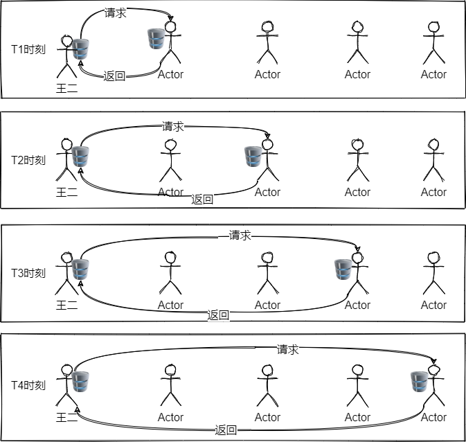
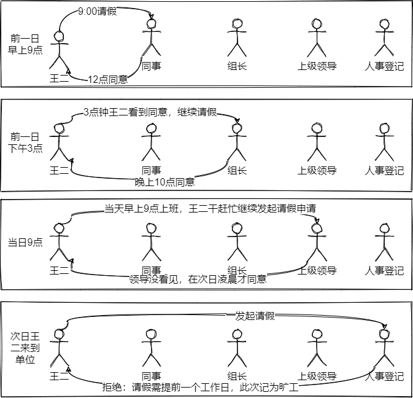

> 图片来源：https://refactoringguru.cn/design-patterns/chain-of-responsibility

# 责任链模式

> 把请求从链中的一个对象传到下一个对象，直到请求被响应为止。通过这种方式去除对象之间的耦合。

通过上面的图其实也能看个差不多了，在这幅图中水桶就是整个链路中被传递的对象。它可以在链路上的任意一个节点被消费，如果你觉得剩的水可以继续给下一个节点用，你甚至可以将它继续传递下去。这样设计的好处就行定义中说的那样，去除对象将的耦合。

假设这个业务场景需要请求的对象是存在联系的，比如具有一定顺序去消费同一个对象，又比如他们消费对象的方法相同，具体逻辑略有差异。此时如果这个水桶对象的传递不通过责任链这种模式，看看会有什么问题。

王二需要分为4个时刻与4个不同的对象进行交互，这无疑增加了系统的复杂性。并且这里其中任意一个请求目标发生变化，王二都必须要跟着调整。再比如下面这个生活中的例子。

王二因为一些原因不能上班，需要和领导请假，卑微的王二在单位的职位级别比较低，需要多级领导审批，甚至同事都是一个坎，让我们看看没有责任链模式介入时王二的请假过程。

王二卒。

## 责任链模式类图 📌

## 代码 📃

## 总结 📚

----

    <b>亦或繁星、亦或尘埃。星尘✨，为了梦想，学习技术，不要抱怨、坚持下去💪。</b>
    
关注<b style='color:blue'>星尘的一个朋友</b>获取源码、加群一起交流学习🤓。

    

