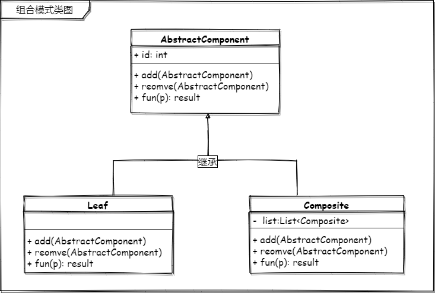
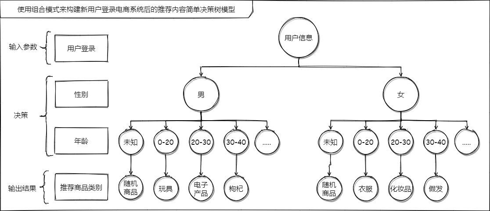

# 聊聊自己理想的“知识”

## 知识该怎么分享

周末的时候去了图书馆，去计算机技术区域想找一些书看，于是翻到了一本《零基础读懂云计算》，我发现我和作者的心态非常相似，他所谈及的就是因为“云计算”被太多太多的人去层层定义，结果导致人们对“云计算”这个词语已经开始有了一些丢失本质的理解了。他站在了“云计算”的本身出发，去掉了对它的层层包装，让读者真正的明白了什么是“云计算”（通过自己的思考），而不是将“云计算”给你定义一个什么什么高大上的名词来让你觉得很神奇的一种姿态来讲，字里行间也流露着他书名的意图。至少我看了之后，可以拨开很多营销或应用谈及的“云计算”虚伪的面纱，如果某人给我说哪个应用是怎么怎么利用“云计算”来完成的某个什么什么业务的时候，我也知道该怎么去追问他然后去判断到底他是不是应用了“云计算”。

我写下的，记录的这个设计模式系列文章《和 lvgo 一起学习设计模式》也是这个初衷。我希望能把每个设计模式也当成一个单纯的“套路”记录下来，然后希望自己以后复习和现在正在阅读的你都能自己去思考其中具体的内容。而不是走马观花或**强行应用某种模式**写一个案例来对自己甚至是正在阅读的你来一个“**洗脑式**”学习。

想要掌握一个知识，一门技术，一定要有自己的理解在其中，保持着怀疑的态度可以学到更多。因为你想知道的更多，随着你知道的越多，你不知道的就越多。**但要注意这个过程是一个体系的深入，而不是发散，不然你会发现自己“虚胖”。**

## 知识该怎么学习

网络中的知识多入牛毛，很多内容大多都是每篇文章作者自己的理解写出来的，还有一些利用“原型模式“写出来的，无关怎么写的，作为读者的我们都应该具备一些内容虚实辨别能力，多去抽象的理解，抛开层层包装，看其本质。而不是”双兔傍地走，安能辨我是雌雄“。举个不恰当就像你怎么辨别一个人是男人还是女人，无关他穿什么衣服，是否化妆，是否整容，是不是长发，等等等等这些外在的包装。（如果是分辨正常人，一定有一个非常准确的办法，我不说你也知道）

# 组合模式

> 将对象组合成树形结构以表示“部分 -整体”的层次结构。组合使得用户对单个对象和组合对象的使用具有一致性

今天要学习的东西有点意思，因为我看到了很多有意思的内容，也在这里记录分享给现在正在阅读的你。

被拉来图书馆，电脑马上扛不住了，搞快。

## 如何理解

上面的定义是 **Gang Of Four 在《可复用面向对象软件的基础》**中对组合模式的意图阐述的内容。

不兜圈子，我先说下我是怎么理解这个设计模式的：**把对象以树形结构放在一起，想要用的时候，操作组合（抽象）对象和操作任意一个对象是一样一样的。**

在学习组合模式之前，我认为它就是把多个对象组装放在一起变成一个更大的对象，这就是我对组合模式最初的理解。但当我自己亲手使用组合模式来编写一段代码的时候我发现，实际情况和我所理解的还是有所差别的。当然这其中的差别只是在于具体的实现上，如果你对组合模式的理解停留在 A + B = C，我觉得这也是正确的。不过还有一个关键的内容，就是 **操作组合对象和操作任意一个对象是一样一样的**。

在这过程中，我问了身边的几个小伙伴，大家都说了组合模式是一个树结构。这也说明了 A + B = C 的形式体现是以树结构形式体现的，后来又在攀谈中聊到了具体的应用，比如：应用的菜单、组织架构，还有 **pom**（这里的 pom 要站在maven角度来看，而不是站在 xml 这种树结构来看）。

### 树形结构

上面的内容说到了 **组合** 模式的一个关键的定义内容，就是它的表现形式是以树形结构来呈现的，这里还想在墨迹一点东西就是组合模式只是利用了树结构这种形式的结构。

### 一致的访问

至于后半段的定义，``对单个对象和组合对象的使用具有一致性`` 理解成对树形结构当中的根节点、子节点、叶节点的访问方式都是一样的。我先总结一下这个原因，这是因为组合模式的实现决定的，组合模式通过递归来实现每个子节点的访问，直到叶节点也是如此，只不过叶节点不会在提供继续递归的能力。

## 组合模式类图 📌

## 让我们一起利用它做点事

现在有一个需求，

## 还有个内容要知道

透明和已知。

## 做个总结 📚

# 再墨迹一点

*设计模式这东西，我最早的理解就是武功秘籍，一招一式都是固定的。丢了一招半式可能就没用了，就像《武状元苏乞儿》中“星爷”饰演的苏乞儿最后来与赵无极那里，降龙十八掌少一掌都打不赢。我想说的就是如果我们代码中某个业务逻辑，业务组件使用了 树形结构+一致的访问，那便是组合模式了。*

----

    <b>亦或繁星、亦或尘埃。星尘✨，为了梦想，学习技术，不要抱怨、坚持下去💪。</b>
    
关注<b style='color:blue'>星尘的一个朋友</b>获取源码、加群一起交流学习🤓。

    

