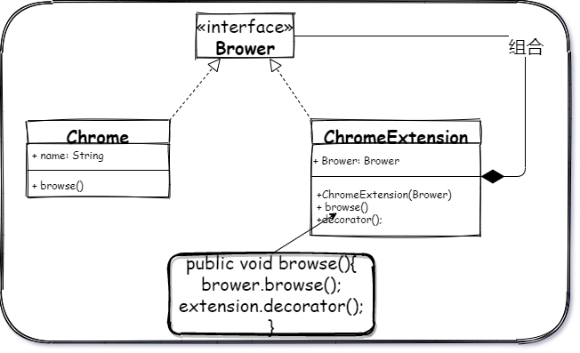
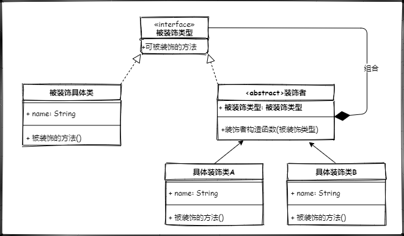

## 题外话

一直都有看到“包装者模式“ 出现在一些文章，甚至书中。它们被应用在装饰者模式和适配器模式中，这个原因源自 GOF 最早在书中给模式命名的时候提到了这两个模式的别名 ``wrapper``, 所以有人将这几个名称混来混去。后来 GOF 在结尾讲书的简史的时候有提到，装饰者模式的名称由 glue 改成了 facade， wrapper 改为 decorator ，walker 变成了 visitor 。


## 前言

前阵子出于自己学习使用的原因开发了一个 chrome extension ，这样我的 chrome 变得比以前更强了，我赋予了它一个可以保存某个页面的某个片段的位置，后续通过点击这个记录可以快速的回到并高亮当时浏览的记录。


**我给 chrome 简单的装饰了一下（加了一个插件），它就变强了**

``插件开源，可以作为基础进行二次开发，想要开发 chrome 插件但是不知道如何开始的可以参考。关注``**星尘的一个朋友**``公众号，回复源码获取``


## 不知不觉你已经知道了装饰者的概念。

> 动态地给一个对象添加一些额外的职责


上面两个举出的例子在实际过程中只要你想，你可以无限的装饰它，所以装饰者的类，可以一直嵌套下去。就像

```java
        InputStream in = new DataInputStream(new FileInputStream(new File("filePath")));
```

如果IO不熟，看得不理解，那再看看这个

```java
        List<Object> list = new ArrayList<>();
        list = Collections.synchronizedList(list);
```

其实，当我写到这里的时候已经很清楚装饰者的概念了，它就是通过“套娃”变强了😂！

让我继续深入看看它的结构图👀。

## 装饰者模式类图 📌




一个浏览器的接口，一个 Chrome 实现类，一个 ChromeExtension 插件的实现类（用以装饰 Chrome），扩展中的构造函数为 浏览器类型，在插件类中会对浏览器 Brower 的 browse 方法进行一层装饰（增强，或减弱），在不改变对象的情况下，对对象行为进行动态的改变。


上面的类图在抽象一层的话就变成了了这个样子



> 为了示意，名称使用了中文，当然如果能够让人清楚你在干什么，无所谓你怎么表达。

## 代码 📄

代码演示通过一个游戏获取道具的方式来理解装饰者模式的具体实现；

想来想去，我没有选择超级玛丽，图难找，代码不好表达🤣

所以我选择了它 **Tank Battle** 😂

``很多回忆都在这里``而且好表达😁

在这游戏中，所有的坦克都可以移动和射击，所以我们有一个 tank 的抽象类


## 总结 🐱‍💻


----
<div align="center">
    <b>亦或繁星、亦或尘埃。星尘✨，为了梦想，学习技术，不要抱怨、坚持下去💪。</b>
    <p>关注<b style='color:blue'>星尘的一个朋友</b>获取源码、加群一起交流学习🤓。</p>
    
</div>
