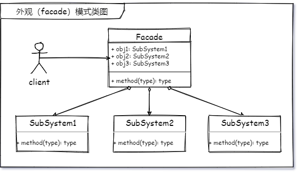
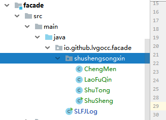
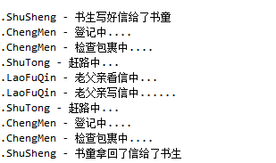

今天用5分23秒，搞懂外观模式，计时~开始！

# 书生的家书


从前，有一个书生，去到很远的地方读书。离开家里久了，难免会思念家乡，于是他便带着书童收拾好行囊，来到城门口登记 —— 接收包裹检查 —— 赶路 ——  到家。几次折腾之后，书生的成绩下滑了，身体也吃不消了，家里觉得这也不是一个长期的办法，于是商量出来一个办法：想家的时候，他便写一份家书，叫自己的书童给他带到老父亲家里。这样一来，书童便拿着他的家书，在城门口进行登记、检查包裹、然后出了城赶路。这使得书生可以专心读书，传递家书的事情，都由书童来做。


书生再也不用为了每次登记检查包裹赶路这些事情费心了，可以**专心的学习做好自己的事情**了。即使哪一天不需要登记了，书生也不需要管，只需要努力学习和想家的时候写好家书送给书童就可以了。


书生为了使自己能够更好的学习，更加专注于自己的 “业务”，将一些复杂的过程交给了书童去处理。至于书童要经历什么，书生并不关心，他只关心你给我提供传递书信的 “服务”，我给你 ”信“，你再回给我 ”信“。

这让我想到了汽车加油，好多人他们只知道没有了去加油站加油就好了，但是并没有多少人清楚石油石化业的艰辛历程。扯远了，回来说我们的问题。

对于书童这种行为，慢慢的演变成了现在的**邮局**。


# 外观模式

> 为多个复杂的子系统提供一个一致的接口，使这些子系统更加容易被访问。


## 第一个想到的外观模式具体的应用

在我学习外观模式之前，我一直在想的事情就是我哪里用到了这个设计模式，脑子里第一个蹦出来的就是 **SLFJ** 这个日志 api 框架，他就是一个日志门面。主要的核心思想就是外观模式，他所负责的，就是书童干的事。提供你一个方法，你把参数给他，他给你返回一个记录日志的对象，至于这中间的复杂过程，你不需要知道。


## MVC

我想，基本上知道编程的人，应该都知道什么是 MVC ，model view control 。但大家仔细研究过这三者的关系吗？当然今天不是主要来介绍 MVC 的，而是通过 MVC 来认识外观模式。其中 V 就是书生，C 就是书童， M 就是具体的送信执行过程。书生（客户端 view）永远都不需要知道 书童（服务端 model）是如何把信送（服务实现）过去和拿回来的。


## 外观模式类图 📌




## 代码 📃

> 回复“源码”获取书童送信全部代码

我们通过代码在看一下书童是如何帮助书生完成送信的，~~看看他路上有没有偷懒~~ 



```java
/**
 * 书生送信 - 书生
 * <p>
 * 欢迎跟我一起学习，公众号搜索：星尘的一个朋友
 * 也可以加我微信（lvgocc）拉你进群
 *
 * @author lvgorice@gmail.com
 * @version 1.0
 * @blog @see http://lvgo.org
 * @CSDN @see https://blog.csdn.net/sinat_34344123
 * @date 2020/11/2
 */
public class ShuSheng {
    static final Logger LOGGER = LoggerFactory.getLogger(ShuSheng.class);

    public static void main(String[] args) {
        LOGGER.info("书生写好信给了书童");
        ShuTong shuTong = new ShuTong();
        shuTong.songXin();
        LOGGER.info("书童拿回了信给了书生");
    }
}
```



我们通过代码可以看出，整个过程书生也没有参与送信的具体过程，这些全部都由书童（外观角色）来完成，这其中设计了 2 个子系统，城门和老父亲。


## 总结 📚

迪米特法则又叫作最少知识原则 LOD/LKP ，1987 年美国东北大学👨‍🎓（Northeastern University）的一个名为迪米特（Demeter）的研究项目....(更多内容关注公众号点击“设计模式”专题序章查看)；

外观模式是一个遵循了迪米特法则的一种设计模式。书生只知道送信找书童，但他不需要知道还要登记、检查等等其他的事情。

外观模式又称作门面模式，理解成门面感觉会更好的理解是不是。至少我认为更好理解一些。就像人的脸面嘛，比如有一件事叫我做，你就跟我说嘛，你也不知道我怎么想的，怎么做的，我给你反馈结果就好了。当然例子可能不是很恰当，希望我要表达的意思能让你看的清楚。

外观模式主要特征
1. √ 降低了系统间的耦合度，子系统的变化不会影响高层模块的调用。
2. √ 提高了高层模块的使用理解。我只想送信，给我接口。
3. × 违背了开闭原则，其实你只要没有遵循依赖倒置，就一定会在功能增加或变更的时候违反开闭原则。如果想要不违背开闭原则，那就需要将依赖的具体的类，转成依赖抽象的类或接口。

**外观模式的扩展** ：上面的案例还可以可以使用一个接口来代替书童的位置，然后让书童来实现这个接口，后面如果想要新增一种送信的工具人实现或者继承送信的接口就可以了。


## 写在最后

一转眼设计模式已经学了 10 种了。时间也过去 3 周了，有些内容可能已经慢慢的开始忘记了，我偶尔也会打开之前的文章在看上一下，如果第一遍第二遍仔细的看过，那后面再看就可以很快的复习一遍。学习任何知识也是如此，如果第一遍第二遍都是走马观花的看，后面每次看都会觉得很陌生，如果前面可以仔细的可，然后定期的复习，很多东西都可以很容易做到，只是时间的问题。当然我这种都是比较笨的学习方法，但是还是蛮有效的。也特别希望大家能够在群里一起讨论一起学习复习，因为每次交流都是一次加深印象的时刻。

**真正掌握一个知识的时候，便是你能把它教给别人的时候。**

----
<div align="center">
    <b>亦或繁星、亦或尘埃。星尘✨，为了梦想，学习技术，不要抱怨、坚持下去💪。</b>
    <p>关注<b style='color:blue'>星尘的一个朋友</b>获取源码、加群一起交流学习🤓。</p>
    
</div>
