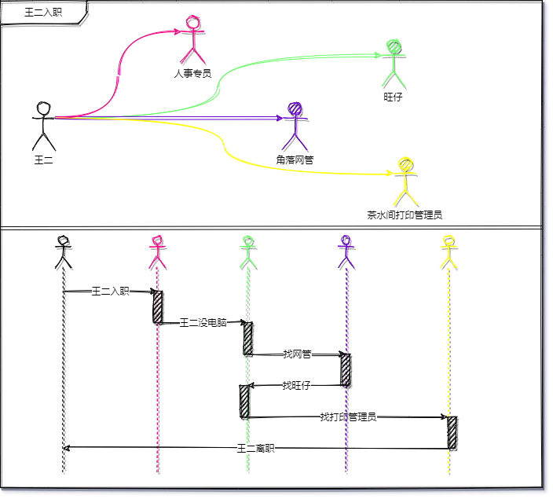
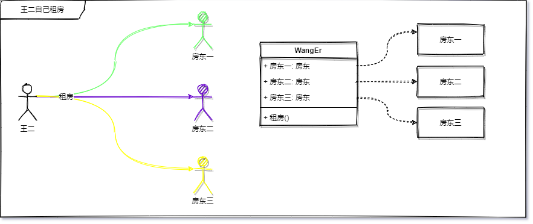
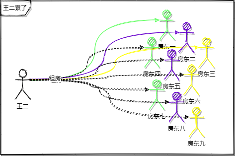
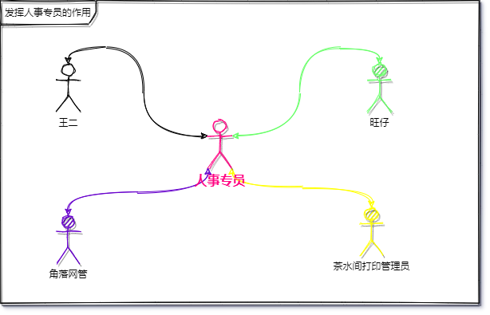
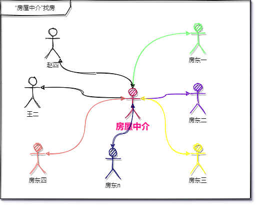
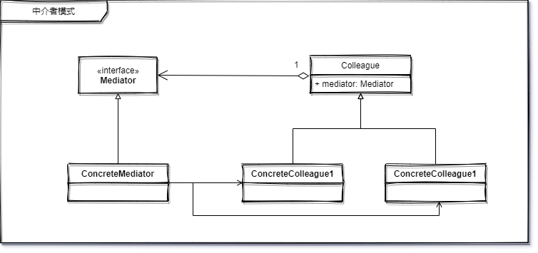

# 中介者模式

> 用一个中介对象来封装一系列的对象交互。中介者使各对象不需要显式地相互引用，从而使其耦合松散，而且可以独立地改变它们之间的交互。

与其说中介者模式还不如说是软件设计原则的具体体现。这个原则就是——迪米特法则。

*这里可以参考之前的系列文章**《和 lvgo 一起学习设计模式 - 序》**中的软件设计基本原则 6 迪米特法则*

- 6️⃣ 迪米特法则又叫作最少知识原则 LOD/LKP ，1987 年美国东北大学👨‍🎓（Northeastern University）的一个名为迪米特（Demeter）的研究项目，由伊恩·荷兰（Ian Holland）提出，被 UML 创始人之一布奇（Booch）🧙‍♂️普及，后来又在经典著作《程序员修炼之道》📕中提及，从而传播开来。原则定义：只与你的直接朋友交谈，不跟“陌生人”说话（Talk only to your immediate friends and not to strangers）。其含义是：<u>如果两个软件实体无须直接通信，那么就不应当发生直接的相互调用，可以通过第三方转发该调用</u>。其目的是降低类之间的耦合度，提高模块的相对独立性。

通过这个原则的核心内容我们知道，迪米特法则（中介者模式）要解决的问题就是提高软件程序的聚合度、降低对象之间的耦合。

## 要解决的问题

### 王二入职

前阵子王二刚刚毕业，入职了一家公司，报道的第一天，人事将王二带到部门后介绍了接头人就走了，王二坐在座位上等待人“接待”他，等了20分钟，没人管他，于是他起身去找了当时的部门接头人旺仔。

“仔哥，我~“，”啊，我知道，你新来的“。”我还没电脑“

“没电脑？你去找那个角落里，那是网管，问他们要一台”，”好的“

王二初来乍到，总觉得哪里不对，又不好意思说，就去角落里问：”您好，我是xxx部新来的，需要领台电脑“，”啊，去找你组长申请“。

“仔哥，那面叫我来和组长申请。我组长是谁啊？”，“我啊，我就是你组长，跟我申请”。王二没说话。“把这个表格打出来，填一下，给我和部门经理签字”，“仔哥，去哪里打印？”，“茶水间边上的房间，找打印机管理员”。

王二蹑手捏脚的过去了，到了那里“您好，我想打份申请单。” “什么申请？”，“离职申请。“王二淡定的说。




### 王二找房

王二最终找到了一个让他满意的地方，然后开始找地方住，所以他开始了繁忙的 “找房之旅” ，一开始，王二一口气就找到了三个房东



```java
房东一 = 10平米，无窗
房东二 = 20平米，半个窗
房东三 = 1000平米，108个窗
```

找了很多，王二也没找到自己心仪的，而此时的王二已经累了。



最后经历了第 10 个房东的时候，王二终于找到自己满意的房子了。

~~**通过这件事我们知道了买房的重要性**~~


## 如何解决

### 王二入职

如果你是这家公司的人事，你会怎么来安排一个新同事的到来的各种事情呢，或者说怎么管理公司间同事的交叉问题呢？

如果是我的话，我会制定一个专员负责管理同事间的诉求，比如人事专员、行政专员等等，当然还可以设立其他专员来解决这种类似的问题。

有了专员之后，专员就负责在各种业务流程上起引导督促等作用。比如刚刚王二入职，人事专员需负责跟踪引导其完成入职知道可以开展工作之前的相关事项。于此同时，王二只需要和人事专员进行通信，其中间的流程步骤变得清晰了很多。

王二：“你好，我这里没有电脑”

人事专员：“已经再给你申请了，稍等”

王二：“好的”

过了，20分钟

设备管理员：“电脑登记好了，给你吧”

人事专员：“好的，我给王二送过去，**你也不认识他**”；

人事专员：“王二，这是你的电脑，编号在背面，有什么问题再联系我”

通过专员的加入，解耦了各个同事之间的耦合，同时降低了各个同事间复杂的交互，~~也避免了不必要的“人才流失”~~



### 王二找房

因为有了输入就会有输出，王二给市场上输入了一种“找房”的需求，市场自然而然的反馈回来一个输出，那就是“房屋中介”

当有了“房屋中介”的加入，王二就没那么辛苦了，并且各个房东的资源因为在“房屋中介”这也会让“租房”变得高效起来。




## 中介者模式类图 📌



模式结构：

1. 中介者接口 Mediator
2. 具体中介者 ConcreteMediator
3. 同事抽象类 Colleague
4. 具体同事 ConcreteColleague

*多学一点：在设计模式中发现几乎所有的模式结构图中，都会有接口或者抽象类，这其实是依赖倒置的默认思路，任何的程序设计这一点原则都要优先考虑。*

## 代码 📃

> 篇幅和过长代码展示原因：完整代码关注回复 “ **源码** “ 获取。

这里通过王二入职案例的解决方案为背景，用程序来表示一下如何解决多个对象间复杂交错导致程序难以维护最终崩溃（离职）的问题。

```java
class HRTest {

    @Test
    void send() {
        HR hr = new HR();
        DeviceManager deviceManager = new DeviceManager(hr);
        hr.addColleague(deviceManager);
        WangEr wangEr = new WangEr(hr);
        hr.addColleague(wangEr);
        WangZai wangZai = new WangZai(hr);
        hr.addColleague(wangZai);

        wangEr.send("我没有电脑");
        deviceManager.send("设备管理员下发一台电脑");
    }
}
```

```java
设备管理员收到消息：我没有电脑
王二收到消息：设备管理员下发一台电脑
```


## 总结 📚

**解决的问题**

1. 在 1 对多对象关系中，可以通过 `中介者模式` 来解耦，达成 1 对 1 的松耦合关系。

**存在的问题**

1. `中介者模式` 自身有个隐患问题，就是中介者自己本身知道了太多的内容。稍有不慎，就会导致 `同事` 的信息出现问题。
2. 由于 `中介者模式`  本身的原因，这个 `中介者` 会变得特别复杂。（对象间的复杂转换成成了类复杂，两权相害取其轻的道理。）
3. 在 多对多 的问题上，最好仔细的考虑一下，甚至考虑要不要用这种模式。


----
<div align="center">
    <b>亦或繁星、亦或尘埃。星尘✨，为了梦想，学习技术，不要抱怨、坚持下去💪。</b>
    <p>关注<b style='color:blue'>星尘的一个朋友</b>欢迎加群一起交流学习🤓。</p>
    
</div>
