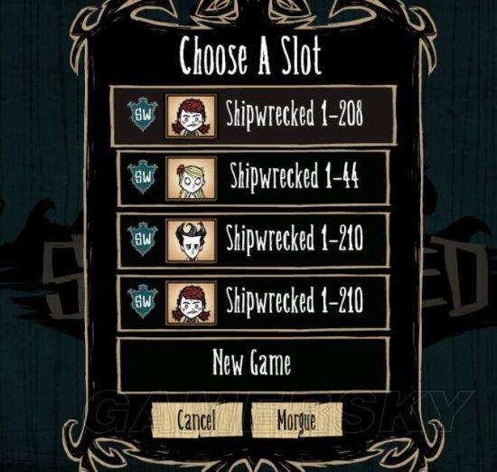
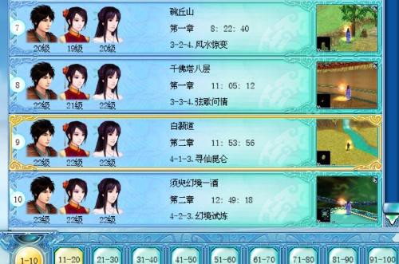
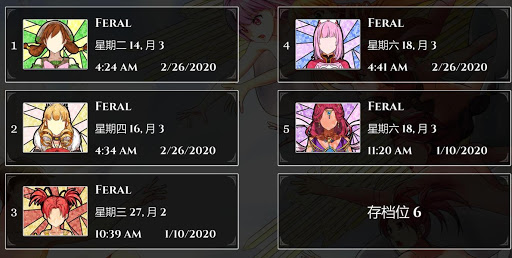
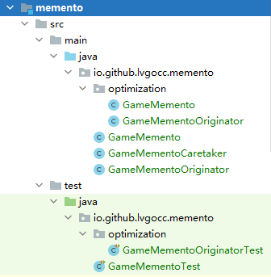
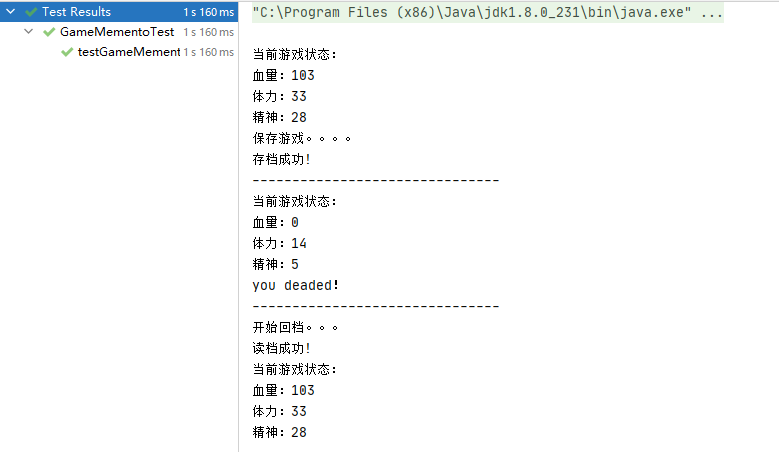
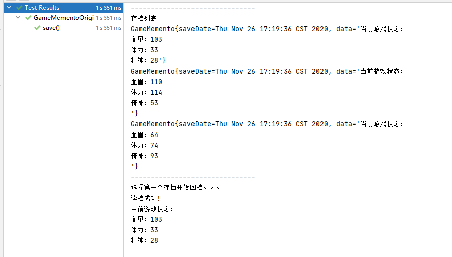
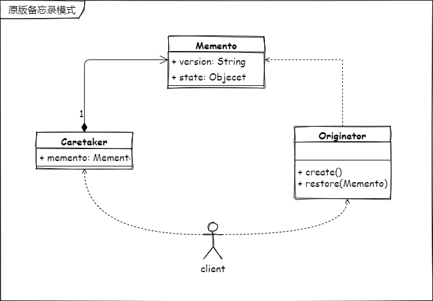
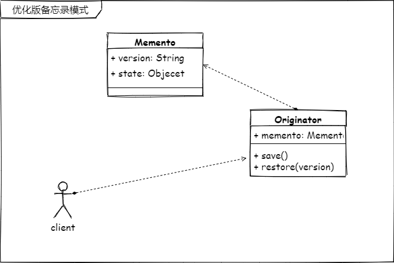

# 备忘录（Memento）模式

> 在不破坏封装性的前提下，获取并保存一个对象的内部状态，以便以后恢复它。

还记得那些年你的游戏存档吗？

**Don't Starve**

**unascribed-game1**

**unascribed-game2**

## 自己实现一个简易版的游戏存档功能

今天写一个游戏存档功能练习一下编码基本功。

**需求分析**

1. 需要有个管理存档的角色，那么多个存档总要有人来管啊，想存档或者读档需要它说了算。
2. 还需要有个具体的存档对象，方便我们管理呀。

**需求设计**

1. 存档对象的管理角色 Caretaker 管理存档对象
2. 存档对象 Memento 具体的存档对象
3. 存档的创建者 Originator 管理“存档”这件事，创建恢复存档。

## 代码 📃

> 完整源码关注回复“源码获取”

测试结果

**展示存档列表**

## 备忘录模式类图 📌

上面的代码是以这种类图方式实现的，不过这在 Java 中显然有可以优化的地方。即将 Caretaker 角色优化掉。优化后的类图

> 两个写法的完整源码关注回复“源码获取”，优化版代码在 optimization 目录中

## 总结 📚

由于备忘录模式使用这种代码构建的方式在 Java 中并不多，这要得益于 Java 的 ``Serializable`` 接口，可以使用序列化来完成备份的操作。所以只是简单的使用一个游戏存档案例记录一下这个知识点，配合学习理解的最好的再就应该是文档编辑功能中的 ``ctrl+z``了。

备忘录模式可以使我们对一个对象的状态进行保存，在需要的时候快速恢复。不得不说的就是备忘录模式如果保存的大量的对象时，内存的占用还是需要关注一下的。在备忘录模式中保存对象的时候，可以配合原型模式来一起使用。

最后，这个模式在 Java 中应该不太香，原因上面也说了。所以**我对这个设计模式仅作为了解**，真正要使用它的话我还是会尽可能的考虑使用 ``Serializable``。

**优点：**无侵入备份/恢复对象状态（**在 Java 里不是很香**）。

**缺点：**GOF 中的写法在 Java 中**不香**，同时使用这种模式需考虑内存占用问题。

----

    <b>亦或繁星、亦或尘埃。星尘✨，为了梦想，学习技术，不要抱怨、坚持下去💪。</b>
    
关注<b style='color:blue'>星尘的一个朋友</b>获取源码、加群一起交流学习🤓。

    

