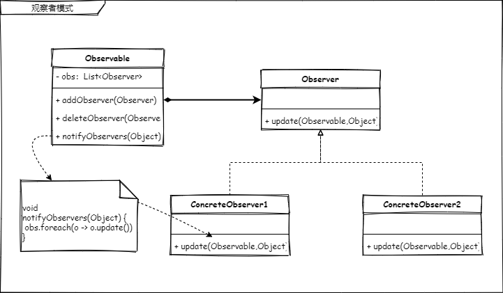

# 观察者模式

> 多个对象间存在一对多关系，当一个对象发生改变时，把这种改变通知给其他多个对象，从而影响其他对象的行为。

提到观察者，就一定有“被观察者”。

被观察者发生改变时，通知给每个观察者，这就是观察者模式。放到生活中的例子就是

- 天气预报的短信通知，在很早以前，我们的天气预报服务可以通过短信的信息订阅。在这个业务场景中，天气预报就是被观察者，每个付费的用户就是观察者，当有最新的天气预报的消息时，会以短信的形式通知给曾经付过费订阅的用户。如果不订阅是不会收到的。
- 你现在在使用的通讯软件中的'群聊'功能，这个相对较为复杂一点，可以抽象的理解一下，用一个人去理解，群里的每个人都是被观察者，每个人都是观察者。当一个人发出消息的时候，所有在群里的人都会收到消息也包括自己。反之，不在群里的人则收不到。
- 还记得小区单元门口一个一个小盒子吗？有的小盒子里是有当天的报纸的。甚至里面的报纸内容可能是不相同的，这里就涉及到了多个被观察者和观察之间的关系，这个小盒子能收到自己订阅的报社报纸，当然你可以同时订阅多个，这样你就可以收到多个报社送过来的报纸了。

对于上面的例子，天气预报需要用户自己付费订阅、群聊需要先进群、在家看报需要联系报社订阅报纸。这里就能看出来。这种关系是一个一对多的关系。被观察者是同一个，而观察者却可以是很多个不同的对象。还有就是观察者需要自己主动的去找被观察者“提前”说明好，“一旦有消息，请通知我一声”。所有这里可以抽象出来几个角色和动作。

1. 被观察者（1个）
2. 观察者（n个）
3. 被观察者负责管理观察者对象
4. 观察者自己负责被观察者给予的通知内容

## 观察者模式类图 📌



1. 被观察者（Observable）
2. 观察者（Observer）
3. 被观察者负责管理观察者对象(Observable.obs)
4. 观察者自己负责被观察者给予的通知内容(Observer.update)

如果对 JDK 熟悉的同学可能早已看穿，这个类图画的其实就是 JDK 提供的观察者框架，我们可以用它轻松的实现一个订阅通知功能。而这一功能在 JDK 1.0 的版本就已经存在了。

## 代码 📃

JDK 源码，篇幅原因只保留了核心代码

```java
package java.util;
// 观察者
public interface Observer {
    void update(Observable var1, Object var2);
}
```

JDK 源码，篇幅原因只保留了核心代码

```java
package java.util;
// 被观察者
public class Observable {
	// 管理观察者对象
    private final Vector<Observer> obs = new Vector();

    public synchronized void addObserver(Observer var1) {
        if (!this.obs.contains(var1)) {
            this.obs.addElement(var1);
        }
    }
    // 通知给订阅的观察者
 	public void notifyObservers(Object var1) {
        Object[] var2 = this.obs.toArray();
        for(int var3 = var2.length - 1; var3 >= 0; --var3) {
            ((Observer)var2[var3]).update(this, var1);
        }

    }
}
```

自己实现部分

```java
public class Producer extends Observable {

    @Override
    public  synchronized void setChanged() {
        super.setChanged();
    }
}
```

```java
public class Consumer1 implements Observer {
    @Override
    public void update(Observable o, Object arg) {
        System.out.println("我是 consumer1 我收到了" + o + "的通知，通知内容：" + arg);
    }
}
```

```java
public class Consumer2 implements Observer {
    @Override
    public void update(Observable o, Object arg) {
        System.out.println("我是 consumer2 我收到了" + o + "的通知，通知内容：" + arg);
    }
}
```

```java
public class Consumer3 implements Observer {
    @Override
    public void update(Observable o, Object arg) {
        System.out.println("我是 consumer3 我收到了" + o + "的通知，通知内容：" + arg);
    }
}
```

测试，定义了 2 个被观察者（生产者），3 个观察者（消费者）来分别使用12生产者来发布消息。

```java
@Test
void jdkOb() {
    Producer producer1 = new Producer();
    producer1.setChanged();
    Producer producer2 = new Producer();
    producer2.setChanged();
    Consumer1 consumer1 = new Consumer1();
    Consumer2 consumer2 = new Consumer2();
    Consumer3 consumer3 = new Consumer3();

    producer1.addObserver(consumer1);
    producer1.addObserver(consumer2);
    producer1.addObserver(consumer3);
    producer2.addObserver(consumer1);
    producer2.addObserver(consumer2);
    producer2.addObserver(consumer3);

    producer1.notifyObservers("我是生产者1，我现在给你们通知一条消息，收到赶紧去消费掉");
    producer2.notifyObservers("我是生产者2，我现在给你们通知一条消息，收到赶紧去消费掉");
}
```

测试结果

```text
我是 consumer3 我收到了Producer@57cd70的通知，通知内容：我是生产者1，我现在给你们通知一条消息，收到赶紧去消费掉
我是 consumer2 我收到了Producer@57cd70的通知，通知内容：我是生产者1，我现在给你们通知一条消息，收到赶紧去消费掉
我是 consumer1 我收到了Producer@57cd70的通知，通知内容：我是生产者1，我现在给你们通知一条消息，收到赶紧去消费掉

我是 consumer3 我收到了Producer@1a7504c的通知，通知内容：我是生产者2，我现在给你们通知一条消息，收到赶紧去消费掉
我是 consumer2 我收到了Producer@1a7504c的通知，通知内容：我是生产者2，我现在给你们通知一条消息，收到赶紧去消费掉
我是 consumer1 我收到了Producer@1a7504c的通知，通知内容：我是生产者2，我现在给你们通知一条消息，收到赶紧去消费掉
```


## 总结 📚

使用观察者模式需要注意的几个点

1. 观察者数量，如果一个被观察者被很多观察者观察（订阅）时，在通知时的时间将会变得漫长；
2. 不能出现被观察者和观察者之间存在循环观察情况，否则系统会直接崩溃；

观察者模式的代码虽然很简单，但是它所创造的价值却远不止这些。相信你同我一样，通过观察者模式联想到了消息通知、binlog订阅、注册中心等技术组件。其核心内容也只是在此简单的不能再简单的思想上去做更多更复杂的功能迭代。

万变不离其宗。在复杂的系统，在复杂的功能，都能找到其根本所在。知识，亦是如此。

当然，你也可以尝试在现有的代码中进行一些修改，比如通知的情况改为有新的观察者加入时？通知的数据变得更丰富一些？异步通知？等等等等。

如果你有更好的点子可以关注并分享给我们（欢迎加群）！


----
<div align="center">
    <b>亦或繁星、亦或尘埃。星尘✨，为了梦想，学习技术，不要抱怨、坚持下去💪。</b>
    <p>关注<b style='color:blue'>星尘的一个朋友</b>获取源码、加群一起交流学习🤓。</p>
    
</div>
