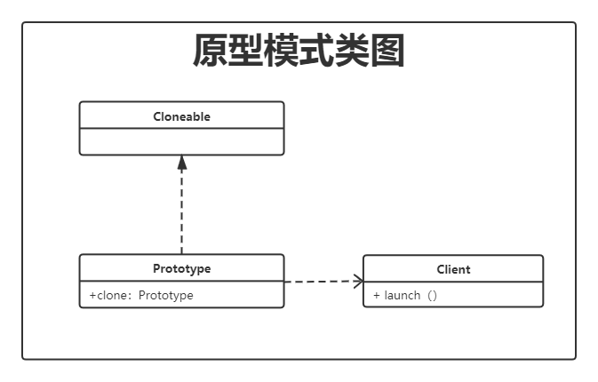

# 原型模式 🎭

> 用一个已经创建的实例作为原型，通过复制该原型对象来创建一个和原型相同或相似的新对象。


> 图片来源：https://refactoringguru.cn/design-patterns/prototype


## 简单理解

每年中秋节的时候，大家都会吃到自己心仪口味的样式各异的月饼，但是他是怎么生产出来的呢，我猜它应该是有一个模板，比如花边图案的月饼


他会创造出来一个月饼原型，当你想吃五仁的时候，就把里面的馅改成五仁的，当你想吃蛋黄的（自己准备鸡蛋），就把馅改成蛋黄的，这样做不仅提高了生产效率，而且还节省了一部分再创建一个月饼的时间。

再比如说可恶的盗图、盗文章、盗视频的人，他们把原创内容拿回去改个名字，去掉水印，随便改改内容，就成了自己的了！？


上面说的两个案例的行为都是在节省了创建时间，同时达到了自己的一些目的。而这在设计模式中，就叫做原型模式，为了解决一个对象的创建而出现的一种设计模式，归类在了创建型模式中。

> 注意：在行为型模式中有着与之类似的一种模式——模版方法模式，是为了解决一件事情中的一系列操作而存在的一种模式，二者的区别在于，原型模式用于对象创建，模板方法模式用于事件行为约束。


## 原型模式类图 📌





## 来看代码 📃

> 完整代码及单元测试结果点击查看 [https://github.com/lvgocc/java-design-patterns/tree/main/prototype](https://github.com/lvgocc/java-design-patterns/tree/main/prototype)

java 的 JDK 中，提供一个标识接口 Cloneable ，我们将需要定义成原型的类实现这个接口就可以完成复制了。

**通过 cloneable 接口实现原型模式**

```java
public class Graphics implements Cloneable {

    private String color;
    private String shape;


    public Graphics(String color, String shape) {
        this.color = color;
        this.shape = shape;
    }

    @Override
    protected Graphics clone() throws CloneNotSupportedException {
        return (Graphics) super.clone();
    }
    
    ..... set/get/toString
}
```


## 浅克隆？🎭 深克隆？🎎 

浅、深指的是对对象的占有权利。比如我借给你一个手机，那你只能使用这个手机里现有的东西，我如果删除了一个软件，那你自然也就没有这个软件了。假如我送给你一个手机，那你就可以随便的使用，不用担心我会做什么了，因为这个手机就是你的了。


那在 java 代码中，我们怎么理解浅克隆🎭 、深克隆🎎 呢？

> 这个道理和值传递和引用传递是一个意思。


实现了 cloneable 接口，可以克隆一个区别于当前对象的另外一个新的对象，但对于对象中的引用，却不能进行克隆，你随得到了他的人，但你却得不到他的心，如果想要得到他的心怎么办？拿钱砸他！非也，你只要把他的心也克隆一份就可以了。但是前提是他的心允许克隆（实现了 cloneable 接口）。


## 原型模式自身有什么优势和问题呢？

**优势：**

1. JDK 的 cloneable 接口是基于内存数据的直接复制，速度相较于 new 关键字创建对象更加快速；
2. 通过**深克隆**来保存一个对象某一时刻的状态，便于还原，实现撤销操作。

问题：

1. 需要为每个类重写 clone 方法
2. 深克隆需要将每个对象都维护一个 cloneable 接口；


## 总结


