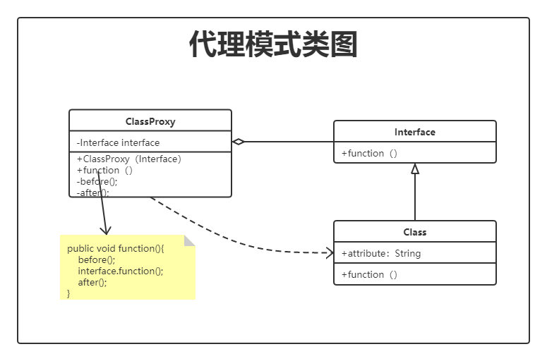

我一直都在想如何学会一个新东西的时候，和旧东西的掌握，有很多前辈给过一些建议和意见，（当然不是直接给我，都是看大佬的文章或者书籍当中。）先去用，再去学。嗯，我想是的，这样肯定是个很正常的学习过程。但是对于一些你暂时无法使用的东西，你如何去掌握它呢？我认为应该抛开表象去了解本质，通过本质的类比去掌握那些暂时无法使用的东西。

我从小就是一个好为人师的家伙，然而自己学习却一直都不怎么样。人太实在，也不懂的包装，我只知道我学习这么差的能学会的东西，讲给别人应该差不哪去。

在学习算法的时候，学到一个特别巧妙而且很好用的解题思路或者说逻辑思维”分而治之“，还有之前和网友讨论的一个叫做”复杂度守恒定律“的东西。这两个东西放在一起，可以说是很”矛盾“了。

说了这么多我想说的就是，设计模式这个知识点，真的很简单又很难。简单是因为每种设计模式的定义拿出来都能看的懂，难是难在如何，何时的应用。而我希望我写的这个设计模式系列是去应用化的，就是单纯的把设计模式的思想记录下来。我所理解的设计模式就该如此。

GOF的《设计模式.可复用面向对象软件的基础》通过一个应用案例的实现，串起了23种设计模式，我想在系列更新完之后也更新一个应用，将 23 种设计模式尽可能的应用到一个应用案例中去，而不是每个设计模式都涉及具体的应用，因为我觉得这可能会带的人们更关注应用的实现，而不是设计模式的应用，这是我的一些想法。

**不要纠结每种模式的具体实现，把它们抽象出来，你能够清楚的描述每种模式是为了解决什么问题而存在的时候，就已经掌握它了，就可以把它用在任何当你需要的时候。而不是问什么时候需要它，这可能有点绕，不过它是真的。不要问我设计模式可以解决哪些问题，把问题给我，我告诉你用什么设计模式可以解决它！**

*我发现我更适合写一些畅谈型的文章*

# 代理模式 👥

> 为某对象提供一种代理以控制对该对象的访问。即客户端通过代理间接地访问该对象，从而限制、增强或修改该对象的一些特性。

代理模式是为了解决对象的访问控制，特别是当你的目标对象不可改变的时候。效果更佳明显。

## 生活中的例子

希望可以用生活中的一些例子能让我更好的去表达和梳理代理模式

### 明星&经纪人

比如经纪人，他代理了明星（主体），负责主体功能以外的事情，主体可以进行商演，但在商演以前或以后的事情，都不需要主体去关系，全部都由经纪人去处理。

### 公园门&门禁

一个公园的门禁，通过门禁系统，代理了公园的入口，公园入口只负责放人进入公园，不关心什么时候什么情况，来人就表示可以进入。门禁系统则负责什么时候，什么情况可以进。

通过使用代理模式，可以让我们的业务代码结构更加完整清晰，而将一些控制和辅助型的逻辑处理交给代理类，这其中体现的就是单一职责原则与迪米特法则。

上面的两个例子，我所想要表达的意思就是说明代理模式是为了控制一个实际对象的访问而存在的一种模式。不知道我说清了没有。

## 身边的例子（程序）

### mybats 的数据访问接口

在代理模式中我们最常用到的应该就是 ORM 框架中的应用了，我们熟知的 mybatis 对数据库的访问控制就是使用了代理模式，通过一个接口的定义，来代理了数据库的访问操作。

在 mybatis 的代理模式处理思想如果翻译成白话：”你将你要执行的 SQL 告诉我在哪（mapper 映射，statement space），语句写好（xml）剩下的你都不用管“，这里的 mapper 接口即代理了数据库的访问工作。

**甚至 #{} ${} 占位符，也是一种代理模式的体现，不一定非要有完整的接口，具体的实现类，代理类才是代理模式。**可能这理解起来会让你觉得有点强词夺理。

## 代理模式类图 📌

## 代码 📄

## 总结 🐱‍💻

# 写在最后

　　Java 设计模式专题，共23 种设计模式。内容来自个人学习理解消化的结果，谈不上教程，只望记录于此同你分享。希望能够和大家一起进步、成长。为了梦想，学习技术。如果你觉得文章对你有帮助，希望随便点赞、关注、分享、给个 star 支持一下。感激涕零🎈。

　　[⭐https://github.com/lvgocc/java-design-patterns](https://github.com/lvgocc/java-design-patterns)

　　**星尘的一个朋友** 亦或繁星、亦或尘埃。星尘，为了梦想，学习技术。

　　关注公众号，回复“加群”，和 lvgo 一起学习设计模式。坚决维护群内环境，给大家提供一个良好的学习交流环境。

