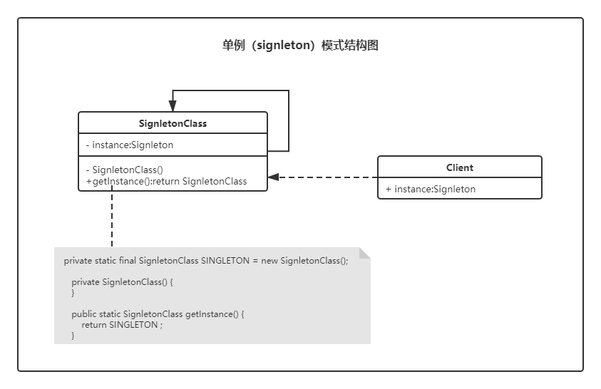

# 单例（Singleton）模式 📍

> 前排提醒：学习设计模式的时候，千万不要咬文嚼字。因为模式本身就是一种思想，我们将其思想领悟，然后活学活用，而不是为了学语文。为了技术，放下语文。因为你接触的模式越多，越会发现很多模式的定义的界线开始模糊，这就是模式本身。一生万物，万物归一。

　　单例模式，顾明思议。单独的实例模式，其表达的意思即字面意思。它要解决的问题就是全局只能存在一个这样的类，或者说存在一个这样的类就可以满足业务需要了。

## 思考以下问题🙄

　　你现在在做一个游戏，游戏中需要用到一个动作的音效🎵，而这个音效的大小有50M（假设），加载一次需要 2s 🕐左右的时间。你在测试的过程中发现，每次人物🧛‍♂️做出动作 2s 左右之后才会出现之前动作音效，现在你需要如何解决这个问题❓

## 资源的合理分配和利用

　　说到资源的合理分配和利用我想到了缓存，现在基本上大部分系统都会配备缓存，那为什么要配备缓存呢？扯远了，我们要谈的还是单例的问题。缓存的内容其实就是对资源的合理利用，比如我们<u>将一些大对象或者频繁的 IO 操作内容保存（缓存）在一个对象中</u>。而单例模式要解决的一个问题，就是这个问题，**资源的合理分配和利用问题**

## 你一直都在用的 singleton 模式

> 其实你如果细心一些你会发现，单例模式你每天都在使用

　　相信我们每位小伙伴都写过一个类，叫做 GlobalConstants （全局常量）而这个类中定义的所有变量（variable）都是 static final 的，大家肯定都知道其中的原因，有 2 个原因：

1. 静态类变量全局访问
2. final 修饰使其内容不可变

> 哦，顺带一提，java  中 String 类也是 singleton 模式的一种体现，当然，这不绝对

- 常量
- 数据库连接池
- Spring ApplicationContext
- JSP Application
- .......

## 单例模式结构📐



**📢要点**

1. 对象有本身自行创建，即构造函数私有化。
2. 全局统一访问，实例可被反复访问，即实例为静态实例。

## 单例模式实现的6种方式

> [完整代码请参考源码目录](https://github.com/lvgocc/java-design-patterns/tree/main/singleton)

　　对于单例模式的实现方法有很多种，也看到大家的思维很活跃。但我脑子也不好使。我只想解决一些根本问题（使用单例模式），所以，我们每种方法都讨论一下。🤣

**<span style="color:red">划重点 : <u>‼ 单例模式的创建只能自己完成</u></span>**

### 1. 延迟加载方式1（懒汉式）(线程不安全❓)

```java
public class DelayLoadSingleton1 {

    private static DelayLoadSingleton1 delayLoadSingleton1;

    private DelayLoadSingleton1() {
    }

    public static DelayLoadSingleton1 getInstance() {
        if (delayLoadSingleton1 == null) {
            delayLoadSingleton1 = new DelayLoadSingleton1();
        }
        return delayLoadSingleton1;
    }
}
```

　　对于**延迟加载（懒汉式）**单例模式的线程不安全其实说的就线程对共享数据的使用而言，但就具体问题而言，<u>单例模式本身就没有线程安全与不安全只分。之所以考虑到线程安全不安全，其实是对上面所说的**资源的合理分配和利用**</u>，这种方式很明显没有做到**资源的合理分配和利用**。如果在多线程场景下很可能造成资源的浪费。

单例模式，根本就没有线程安全与不安全，是错误的使用导致它有了这个问题。

> 📃lvgo语录：学东西要知其然而知其所以然，即使千年流传的东西，你都应该保持着一颗质疑的心。❓❤🙄

### 2. 延迟加载方式2（懒汉式）

```java
public class DelayLoadSingleton2 {

    /**
     * 增加 volatile 修饰，解决变量可见性问题
     */
    private static volatile DelayLoadSingleton2 delayLoadSingleton1;

    private DelayLoadSingleton2() {
    }

    /**
     * 方法使用同步锁🔒，同时只能有一个客户端来请求该方法，去创建实例。
     * <p>
     * 如果不使用同步方法，可能会出现两个以上线程同时创建了多个对象，破坏了单例模式，至于线程安全，其实也是说对资源的合理利用。拒绝了重复创建
     */
    public static synchronized DelayLoadSingleton2 getInstance() {
        if (delayLoadSingleton1 == null) {
            delayLoadSingleton1 = new DelayLoadSingleton2();
        }
        return delayLoadSingleton1;
    }
}
```

> 关于 volatile 的更多内容欢迎在个人博客搜索关键字 "volatile"

通过使用同步锁与 volatile 使得单例模式变得~~安全~~资源合理的分配和利用，但每次调用都要同步，岂不是另外一种资源的浪费体现？🙄

### 3. 双重检查锁 （DCL）🔒

　　既然要合理利用资源，又要保证调用方法本身不产生资源浪费。这样就促成了 DCL 双重检查锁🔒方式。*（技术人的思维就是这么活，一个单例模式被实现的五花八门。害的我们这些设计模式学徒从入门到放弃越来越快）*

　　前面说了 DCL 是为了解决资源的合理分配和利用，那我们一起来看看 DCL 是如何工作的

```java
public class DCLSingleton {
    private static volatile DCLSingleton dclSingleton;

    private DCLSingleton() {}

    public static DCLSingleton getInstance() {
        // 定义这个局部变量可以提高大约25%的性能🚀 依据:Joshua Bloch "Effective Java, Second Edition", p. 283-284
        DCLSingleton current = dclSingleton;
        // 1️⃣ 第一次检查
        if (dclSingleton == null) {
            // 🔒此时为了保证线程安全,我们不清楚其他线程是否已经实例化该对象,所以将类上锁达到互斥效果
            synchronized (DCLSingleton.class) {
                /*
                 * 再次将实例分配给局部变量并检查它是否由其他某个线程初始化
                 * 当前线程被阻止进入锁定区域。 如果它已初始化，那么我们可以
                 * 返回先前创建的实例，就像上面检查对象是否为空一样。
                 */
                current = dclSingleton;
                // 2️⃣ 第二次检查
                if (dclSingleton == null) {
                    // 如果此时该类还没有被实例化,那么我们就可以安全的实例化一个单例的该对象实例.
                    current = dclSingleton = new DCLSingleton();
                }
            }
        }
        return current;
    }
}
```

　　📃笔记：DCL 方式是为了解决延迟加载（懒汉式）中的资源合理分配和利用问题。

　　**当然，以上 3 种方式我，注意是我！全不推荐使用！！**😂

-----

### 4. 立即加载方式（饿汉式）

```java
public class StraightwaySingleton {

    private static StraightwaySingleton straightwaySingleton = new StraightwaySingleton();

    private StraightwaySingleton() {
    }

    public static StraightwaySingleton getInstance() {
        return straightwaySingleton;
    }
}
```

　　立即加载方式是通过 classloader 来完成单例的创建，即当类第一次被主动调用初始化的时候。即使该类你不会使用（但是❗不用你还要设计成单例，我觉得这种方式已经可以满足一般的业务场景了）

> 拓展类的装载过程：加载 -  验证 - 准备 - 解析 - 初始化 - 使用 -  卸载

### 5. 内部类 （推荐使用）

```java
public class InnerClassSingleton {

    private InnerClassSingleton() {
    }

    public static InnerClassSingleton getInstance() {
        return InnerClassSingletonBuild.innerClassSingleton;
    }

    private static class InnerClassSingletonBuild {
        private static InnerClassSingleton innerClassSingleton = new InnerClassSingleton();
    }

}
```

这个方式综合使用了Java的 **<u>类级内部类</u>** 和多线程缺省同步锁的知识 JVM 来保证资源不会被浪费，巧妙地同时实现了**延迟加载和线程安全**，比起花里胡哨的 DCL ，这种方式更好的解决了实质的问题，并且没有了 DCL 的副作用，同时不受jdk版本的影响。

<span style="color:red">**👍当你的业务场景，很明确系统 📢<u>启动不需要的时候，以后也不知道需不需要</u> ，不用怀疑，用它！稳！资源控制的死死的**</span>

*一般我们默认会选择这种方式来实现单例模式，简单、好用、强大。*

关于内部类的一些拓展，更多关于内部类内容查看我的 [CSDN 博客](https://blog.csdn.net/sinat_34344123/article/details/81942427)

**内部类分为对象级别和类级别**

- 类级内部类指的是，有static修饰的成员变量的内部类。

- 如果没有static修饰的成员变量的内部类被称为对象级内部类。

类级内部类相当于其外部类的static成员，它的对象与外部类对象间不存在依赖关系，相互独立，因此可直接创建。

对象级内部类的实例，是必须绑定在外部对象实例上的。

**<u>类级内部类只有在第一次被使用的时候才被会装载。</u>**

### 6. 枚举（推荐使用）

```java
public enum EnumIvoryTower {

    /**
     * 实例
     */
    INSTANCE;
}
```

> 这种方法是一个叫做 Joshua Bloch 的人提出的，对于学习这种单例模式，我觉得更有必要带大家认识一下这个人。待会介绍。先说这种设计方式。

<span style="color:red">**👍 Joshua Bloch 推荐的一种单例方式，与立即加载方式有过之而无不及。**</span>

**简单、大方、得体、完美**

对于用枚举来实现单例模式近乎完美。因为它完完全全的由虚拟机来完成单例创建，这种方式是不是想到了和我们上面讲到的一个方式有点类似，没错，就是我们的立即加载方式（饿汉式），但是它相比立即加载方式却多了很多内容。就是我们接下来要说的保护单例模式。同时少了一点点东西——继承。

## 保（po）护（huai）单例模式

### 破坏单例

有即时我们使用了以上的方式创建单例对象，同样会有两种方式来破坏单例对象 （除枚举方式外）

1. 通过反射破坏单例
2. 通过序列化破坏单例

### 保护单例

上面的两点对于枚举来说，不存在。但我们自己写的方法如何规避这两点呢？

1. 调整私有构造函数，阻止反射调用单例。
2. 重写 readResolve() 方法。

#### 调整私有构造函数，阻止反射调用单例

```java
	// 解决反射创建对象破解单例模式
    if (dclSingleton != null) {
        throw new IllegalStateException("Already initialized");
    }
```

#### 重写 readResolve() 方法

```java
    /**
     * 解决反序列化创建对象破坏单例模式
     */
    private Object readResolve() {
        return straightwaySingleton;
    }
```

## 单例模式总结

### 📢要点

1. 对象有本身自行创建，即构造函数私有化。
2. 全局统一访问，实例可被反复访问，即实例为静态实例。

### 实现方式的选择

内部类 > 枚举 > 立即加载

### ~~优缺点~~

~~我以为设计模式本身就是一种解决问题的办法，优缺点就本身而言有意义。相对来说即无意义。既然选择了这种模式，那固然有一定的道理。所以以后设计模式的优缺点也不会过多发表意见，没有最好，只有最合适。优缺点已经没有意义了。~~

~~优点：资源的合理分配和利用~~

~~缺点：违反了单一职责原则~~

## 简单说说 Joshua Bloch

《Effective Java》、Effective 系列图书作者。同时我们每天都在使用着他写的代码，集合框架，它们的位置位于``java.util.*``。

```java
 * @param <E> the type of elements in this collection
 *
 * @author  Josh Bloch
 * @author  Neal Gafter
 * @see     Set
 * @see     List
 * @see     Map
 * @see     SortedSet
 * @see     SortedMap
 * @see     HashSet
 * @see     TreeSet
 * @see     ArrayList
 * @see     LinkedList
 * @see     Vector
 * @see     Collections
 * @see     Arrays
 * @see     AbstractCollection
 * @since 1.2
 */

public interface Collection<E> extends Iterable<E> {
```

老爷子的github ：https://github.com/jbloch

-----

# 写在最后

　　Java 设计模式专题，共23 种设计模式。内容来自个人学习理解消化的结果，谈不上教程，只望记录于此同你分享。希望能够和大家一起进步、成长。为了梦想，学习技术。如果你觉得文章对你有帮助，希望给个 star 支持一下。感激涕零。

　　[⭐https://github.com/lvgocc/java-design-patterns](https://github.com/lvgocc/java-design-patterns)

　　欢迎大家关注我的个人公众号：**星尘的一个朋友** 刚刚开始弄，希望与你一起成长！


