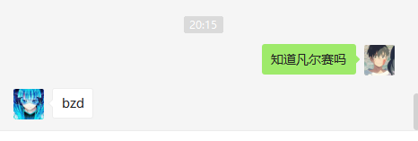

# 访问者模式

> 将作用于某种数据结构中的各元素的操作分离出来封装成独立的类，使其在不改变数据结构的前提下可以添加作用于这些元素的新的操作，为数据结构中的每个元素提供多种访问方式。它将对数据的操作与数据结构进行分离，是行为类模式中最复杂的一种模式。

刚看到这个模式的时候，我人都傻了，完全不知道说的是啥，直到看了近5份资料！才搞清楚这个设计模式，不愧是最复杂的一种，我也这样觉得。不过千万别被复杂吓到，捋清了之后，还是比较简单的。

## 开门见山

访问者模式“人如其名”，就是说不同的访问者对同一个对象的访问结果不同。为什么会不同呢？因为这个访问者是我们自己定义的，我们就想让他不同😂。

而实际情况更是如此。我通过几份资料总结下来，这个访问者模式所谓的访问者其实就是我们想要控制的访问权限一样。因为任何一个“访问者”都可以看到具体数据的全部内容，他只是选择性的"不看“，这样便区分开了”访问者“**关注的内容**，或者**”限制“了”访问者“的权限**。

可能我说的有点绕，有点抱歉，我再简化一下这个内容。

## 网络用语

**抛开表象看本质**

如果我们抛开访问者模式这些专业的定义，单纯的去理解这个访问者模式要表达的意思，我觉得用一个东西最合适不过。那就是“网络用语”；

不知道大家听没听过前阵子火了的百度广告《你说啥》单曲。歌曲中的朝阳大妈就是一个不知道关注点或者是被限制了访问权限的访问者，当然他歌曲中说的网络语有好多我也不知道是啥🙃。没听过的快去听吧。

还有最近的 `凡尔赛文学` 我不百度的时候以为是个地名，所以我的 `权限` 也被限制了。

正好提到这个了，那我们就拿 `凡尔赛文学` 这个网络语来学习一下访问者模式吧~🤩


## 凡尔赛文学

**首先我们就要再一次抛开表象看本质😂**

下面是我搜集到有关凡尔赛的释义：

1. 凡尔赛是法国巴黎的卫星城以及伊夫林省省会，曾是法兰西王朝的行政中心。
2. 《凡尔赛》是皮埃尔·苏勒执导的剧情片。
3. 以法国路易十四为时代背景的电视剧。
4. 凡尔赛文学，网络热词，指通过先抑后扬、自问自答或第三人称视角，不经意间露出"贵族生活的线索"。
5. 啥？？？

对于凡尔赛一共有 5 种释义，他的结构应该是这样的

```java
public class Versailles {

    private final String interpretation1 = "凡尔赛是法国巴黎的卫星城以及伊夫林省省会，曾是法兰西王朝的行政中心。";
    private final String interpretation2 = "《凡尔赛》是皮埃尔·苏勒执导的剧情片。";
    private final String interpretation3 = "以法国路易十四为时代背景的电视剧。";
    private final String interpretation4 = "凡尔赛文学，网络热词，指通过先抑后扬、自问自答或第三人称视角，不经意间露出\"贵族生活的线索\"。";
    private final String interpretation5 = "啥？？？";
    
}
```

因为我们还要对这个数据进行访问，所以还要给他加个访问的方法 #visit

```java
public class Versailles {

   .....
       ....
       ...
    /*
     * 访问
     */
    public void visit(){

    }
}
```

既然要访问，肯定要有访问者啊，因为访问者挺多的，比如我、我的小伙伴、还有你，所以我们就使用依赖倒置原则来定义一个访问者接口 `Visitor` 然后有个访问方法，再把凡尔赛给访问者去让其自己访问，那代码实现起来应该是这样的。

 `Visitor`接口

```java
public interface Visitor {
    void visit(Versailles versailles);
}
```

凡尔赛的访问方法调整一下，最终完整类如下

```java
public class Versailles {

    private final String interpretation1 = "凡尔赛是法国巴黎的卫星城以及伊夫林省省会，曾是法兰西王朝的行政中心。";
    private final String interpretation2 = "《凡尔赛》是皮埃尔·苏勒执导的剧情片。";
    private final String interpretation3 = "以法国路易十四为时代背景的电视剧。";
    private final String interpretation4 = "凡尔赛文学，网络热词，指通过先抑后扬、自问自答或第三人称视角，不经意间露出\"贵族生活的线索\"。";
    private final String interpretation5 = "啥？？？";

    /**
     * 将该对象提供给访问者访问
     * @param visitor 访问者
     * 方法名改成 accept 更好，表示这个类接受一个访问者来访问自己🙅
     */
    public void accept(Visitor visitor){
        visitor.visit(this);
    }
}
```

接下来就是具体的访问者了，那我根据实际情况来定义一些访问者

1. I
2. MyFriend
3. You

一共三个访问者

**I**（我自己）

我比较博学多识，我知道凡尔赛是地名、电影、电视剧三个

**MyFriend**（狗哥）

看他的样子应该是不知道




**You**（你呢？）

我就当你知道凡尔赛文学，已经领悟到了无形装逼的境界好了🌚

看下这三个类的情况

```java
/**
 * 我比较博学多识
 * <p>
 * 欢迎跟我一起学习，微信（lvgocc）公众号搜索：星尘的一个朋友
 *
 * @author lvgorice@gmail.com
 * @version 1.0
 * @blog @see http://lvgo.org
 * @CSDN @see https://blog.csdn.net/sinat_34344123
 * @date 2020/12/1
 */
public class I implements Visitor {
    @Override
    public void visit(Versailles versailles) {
        System.out.println(versailles.getInterpretation1());
        System.out.println(versailles.getInterpretation2());
        System.out.println(versailles.getInterpretation3());
    }
}
// 弱智狗哥
public class MyFriend implements Visitor {
    @Override
    public void visit(Versailles versailles) {
        System.out.println(versailles.getInterpretation5());
    }
}
// 网络达人
public class You implements Visitor {
    @Override
    public void visit(Versailles versailles) {
        System.out.println(versailles.getInterpretation4());
    }
}
```

最后我们在模拟一下运行起来的情况

```java
class VisitorTest {

    @Test
    void visit() {
        Versailles versailles = new Versailles();

        System.out.println("lvgo 你知道凡尔赛吗？");
        versailles.accept(new I());

        System.out.println("\n狗哥 你知道凡尔赛吗？");
        versailles.accept(new MyFriend());
        
        System.out.println("\n你知道凡尔赛吗？");
        versailles.accept(new You());
    }
}
```

结果，狗哥拉胯

```java
lvgo 你知道凡尔赛吗？
凡尔赛是法国巴黎的卫星城以及伊夫林省省会，曾是法兰西王朝的行政中心。
《凡尔赛》是皮埃尔·苏勒执导的剧情片。
以法国路易十四为时代背景的电视剧。

狗哥 你知道凡尔赛吗？
啥？？？

你知道凡尔赛吗？
凡尔赛文学，网络热词，指通过先抑后扬、自问自答或第三人称视角，不经意间露出"贵族生活的线索"。
```

不同的访问者，看到数据结构中的结果不同。再来看下访问者的定义

```
在不改变集合元素的前提下，为一个集合中的每个元素提供多种访问方式，即每个元素有多个访问者对象访问。
```

虽然我们这里用的是一个对象，试着将它变成集合吧。使用循环把每个元素都“送”给访问者，这个就留着给你动手试试吧，也留给自己以后回来看的时候能被逼动动脑😂。实在不想动，关注回复 “源码” 吧！😀


## 访问者模式类图 📌


## 总结 📚

----
<div align="center">
    <b>亦或繁星、亦或尘埃。星尘✨，为了梦想，学习技术，不要抱怨、坚持下去💪。</b>
    <p>关注<b style='color:blue'>星尘的一个朋友</b>欢迎加群一起交流学习🤓。</p>
    
</div>
